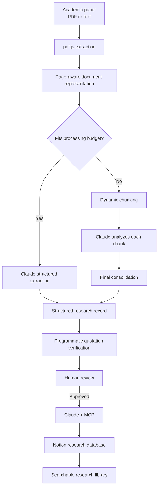

# Fichário Acadêmico

### Claude-powered Research Knowledge System

**A source-grounded research workflow for turning academic papers into structured, traceable, human-reviewed knowledge.**

Fichário Acadêmico is a research knowledge system created by **Guilherme da Conceição Vasconcelos** to support academic work in Civil Engineering. It processes scholarly papers, extracts structured research information with Claude, verifies quotations programmatically against their source pages, allows human review, and organizes approved results into searchable Notion databases through MCP.

This repository documents the current version of a tool originally developed for my academic workflow in Civil Engineering.

> AI can propose the knowledge. The source document must still be able to prove it.

## Why I built it

Academic literature review often repeats the same workflow: read a paper, identify its objective, extract metadata, locate useful passages, record page numbers, classify the study, organize the result, and later recover it reliably.

The hard part is not simply generating a summary. It is preserving **where the information came from**.

Fichário Acadêmico was designed around four ideas:

- **source grounding**
- **structured extraction**
- **programmatic quotation verification**
- **human-in-the-loop review**

## Architecture



## What Claude does

Claude is the primary intelligence layer of the system. It is used to:

- extract bibliographic metadata;
- identify research objectives or theses;
- classify papers by research line;
- identify related technical standards;
- select useful quotations with page references;
- consolidate findings from long documents;
- interact with Notion through MCP.

The application is **Claude-first**. It prefers **Claude Sonnet 5** and only uses a model fallback when the runtime explicitly reports a model-compatibility problem.

## Structured extraction

The runtime attempts structured extraction in a capability-aware order:

1. **JSON Outputs** through `output_config.format`;
2. **Strict Tool Use** through `strict: true`;
3. forced standard tool use as a compatibility path.

A rate limit, timeout, authentication failure, schema bug, or server error does not silently trigger a capability fallback.

The application includes a runtime diagnostics panel so observed capabilities are reported only after successful requests.

## Full-document processing

PDF content is extracted page by page and represented with explicit page identity.

For longer papers, dynamic chunking is used instead of truncating the document. Each chunk retains source-page information. Partial chunk analyses are then consolidated into a single research record.

If a chunk fails after one retry, the process stops rather than presenting an incomplete analysis as complete.

PDFs above the configured page limit are rejected explicitly rather than silently truncated.

## Source-grounded quotations

Claude can propose a quotation such as:

```json
{
  "quote": "Exact passage extracted from the paper...",
  "page": 8
}
```

The application then searches the extracted text of page 8.

Only a passage found in the original page text is marked as:

`✓ Verified in document · Page 8`

Otherwise it is flagged as unverified.

The verifier normalizes common PDF-extraction differences such as whitespace, line breaks, line-break hyphenation, Unicode quotation marks, and dash variants. A paraphrase is not accepted as an exact quotation.

Quotation verification is recalculated when the researcher edits the passage or changes its page, and all quotations are revalidated immediately before persistence.

## Human-in-the-loop review

AI output is never written directly into the permanent knowledge base.

Before saving, the researcher can review:

- title;
- authors;
- year;
- academic reference;
- DOI and URL;
- research category;
- technical standards;
- thesis / objective;
- useful quotations;
- relevance;
- observations.

Unverified quotations require explicit confirmation before saving.

## Notion + MCP

Approved records are persisted to Notion through Claude and the Model Context Protocol.

The MCP layer supports:

- research database creation;
- page creation;
- record retrieval;
- page archival.

The code distinguishes between the current public MCP Connector format and a constrained-runtime compatibility path. MCP tool results are inspected for tool-level failures before an operation is considered successful.

## Research areas

The current configuration supports three Civil Engineering research tracks:

### Wind in Structures
Dynamic wind phenomena, structural response, technical standards, dynamic effects, modeling, and experimental studies.

### Marble Waste / Rheology
Rheology, fresh and hardened state, cementitious materials, permeable concrete, and cement paste.

### AI for Structural Engineering
Artificial intelligence applied to structural calculation, modeling, simulation, optimization, prediction, machine learning, neural networks, automation, and validation.

The research configuration is declarative so new research tracks can be introduced without rewriting the processing pipeline.

## Technology

- React
- JavaScript
- pdf.js
- Claude API
- Claude Sonnet 5
- JSON Outputs
- Strict Tool Use
- Model Context Protocol
- Notion
- Lucide React

## Design principles

1. **Source grounding**: important evidence remains connected to the document that produced it.
2. **Structured knowledge**: research information should be queryable rather than trapped in generated prose.
3. **Human oversight**: AI assists the researcher but does not silently modify the permanent knowledge base.
4. **Explicit failure**: incomplete processing produces an error instead of an apparently complete result.
5. **Explainable architecture**: each stage can be inspected and defended independently.

## Runtime and deployment notes

The original application runs as a **Claude.ai Artifact**, so some capabilities depend on the Artifact sandbox.

A production deployment should move provider credentials behind a backend or serverless layer:

```text
React frontend
      ↓
Secure backend / serverless layer
      ↓
Claude API + MCP Connector
      ↓
Notion
```

External AI-provider support is intentionally treated as deployment-specific and no API secrets belong in this repository.

## Project status

**Active research tool.**

The current version focuses on reliable literature processing, source traceability, and integration with my academic research workflow. Future work may extend deployment and observability as the tool continues to be used.

## Author

**Guilherme da Conceição Vasconcelos**  
Civil Engineering · AI-assisted research workflows  
GitHub: [@Guibasss](https://github.com/Guibasss)

---

No open-source license is granted unless a license file is added explicitly.
